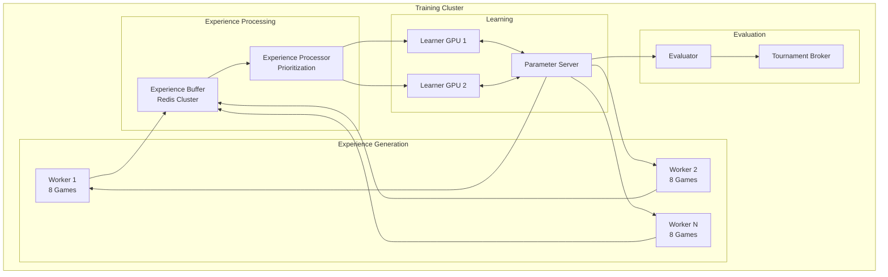

# Generals.io Reinforcement Learning: Training Next Steps & Architecture Roadmap

## Executive Summary

This document outlines a comprehensive 6-12 month roadmap for evolving the Generals.io RL training infrastructure from its current prototype state to a production-ready, scalable system capable of training superhuman agents through self-play.

## 1. Training Architecture Evolution

### 1.1 Current State Analysis

**What We Have:**
- Basic OpenAI Gym environment wrapper
- Simple DQN implementation with experience replay
- Single-machine training capability
- gRPC-based game server with experience streaming
- Basic checkpointing and metrics

**Limitations:**
- Single game instance training
- No distributed training
- Limited to DQN algorithm
- No self-play infrastructure
- No systematic evaluation framework

### 1.2 Target Architecture



### 1.3 Implementation Phases

**Phase 1: Multi-Game Training (Weeks 1-2)**
```python
# generals_gym/distributed/worker.py
class ExperienceWorker:
    def __init__(self, num_games=8, server_address="localhost:50051"):
        self.games = [GeneralsEnv(server_address) for _ in range(num_games)]
        self.experience_queue = multiprocessing.Queue()
        
    async def run_games_parallel(self):
        """Run multiple games in parallel using asyncio"""
        tasks = [self.run_single_game(env) for env in self.games]
        await asyncio.gather(*tasks)
```

**Phase 2: Distributed Experience Buffer (Weeks 3-4)**
```python
# generals_gym/distributed/experience_buffer.py
import redis
import pickle
import numpy as np

class DistributedExperienceBuffer:
    def __init__(self, redis_host="localhost", capacity=1000000):
        self.redis_client = redis.Redis(host=redis_host, decode_responses=False)
        self.capacity = capacity
        
    def add_experience(self, exp):
        # Compress and store
        compressed = pickle.dumps(exp, protocol=pickle.HIGHEST_PROTOCOL)
        self.redis_client.lpush("experiences", compressed)
        self.redis_client.ltrim("experiences", 0, self.capacity)
    
    def sample_batch(self, batch_size=256):
        # Prioritized sampling with TD-error weighting
        pass
```

**Phase 3: Distributed Learning (Weeks 5-8)**
```yaml
# kubernetes/training-deployment.yaml
apiVersion: apps/v1
kind: StatefulSet
metadata:
  name: generals-learner
spec:
  replicas: 4
  template:
    spec:
      containers:
      - name: learner
        image: generals-rl:latest
        resources:
          limits:
            nvidia.com/gpu: 1
        env:
        - name: ROLE
          value: "learner"
        - name: PARAMETER_SERVER
          value: "parameter-server:6006"
```

## 2. Neural Network Architecture Recommendations

### 2.1 Current Architecture Analysis

**Current Simple CNN:**
- 3 conv layers (32, 64, 64 filters)
- 2 FC layers (256, n_actions)
- No batch normalization
- No residual connections

### 2.2 Recommended Architecture Evolution

**Stage 1: Enhanced CNN with Residual Blocks**
```python
class ResidualBlock(nn.Module):
    def __init__(self, channels):
        super().__init__()
        self.conv1 = nn.Conv2d(channels, channels, 3, padding=1)
        self.bn1 = nn.BatchNorm2d(channels)
        self.conv2 = nn.Conv2d(channels, channels, 3, padding=1)
        self.bn2 = nn.BatchNorm2d(channels)
        
    def forward(self, x):
        residual = x
        x = F.relu(self.bn1(self.conv1(x)))
        x = self.bn2(self.conv2(x))
        x = F.relu(x + residual)
        return x

class ImprovedNetwork(nn.Module):
    def __init__(self, input_channels=9, num_actions=500):
        super().__init__()
        # Initial convolution
        self.conv_input = nn.Conv2d(input_channels, 128, 3, padding=1)
        self.bn_input = nn.BatchNorm2d(128)
        
        # Residual tower (10 blocks)
        self.res_blocks = nn.ModuleList([
            ResidualBlock(128) for _ in range(10)
        ])
        
        # Policy head
        self.policy_conv = nn.Conv2d(128, 32, 1)
        self.policy_bn = nn.BatchNorm2d(32)
        self.policy_fc = nn.Linear(32 * board_size, num_actions)
        
        # Value head
        self.value_conv = nn.Conv2d(128, 32, 1)
        self.value_bn = nn.BatchNorm2d(32)
        self.value_fc1 = nn.Linear(32 * board_size, 256)
        self.value_fc2 = nn.Linear(256, 1)
```

**Stage 2: Attention Mechanisms**
```python
class SpatialAttention(nn.Module):
    """Self-attention for board positions"""
    def __init__(self, channels):
        super().__init__()
        self.query = nn.Conv2d(channels, channels // 8, 1)
        self.key = nn.Conv2d(channels, channels // 8, 1)
        self.value = nn.Conv2d(channels, channels, 1)
        
    def forward(self, x):
        B, C, H, W = x.shape
        q = self.query(x).view(B, -1, H*W).permute(0, 2, 1)
        k = self.key(x).view(B, -1, H*W)
        v = self.value(x).view(B, C, H*W).permute(0, 2, 1)
        
        attention = F.softmax(torch.bmm(q, k) / (C ** 0.5), dim=-1)
        out = torch.bmm(attention, v).permute(0, 2, 1).view(B, C, H, W)
        return out + x  # Residual connection
```

### 2.3 Input Representation Improvements

**Enhanced Observation Channels (15 total):**
```python
def get_enhanced_observation(game_state):
    """
    Channel 0-6: Original channels (visibility, ownership, army, tile types, turn)
    Channel 7: Distance to nearest enemy
    Channel 8: Distance to nearest city
    Channel 9: Distance to own general
    Channel 10: Estimated enemy strength heatmap
    Channel 11: Territory growth potential
    Channel 12: Choke point identification
    Channel 13: Front line indicator
    Channel 14: Historical move frequency (last 10 turns)
    """
    pass
```

## 3. Algorithm Progression Path

### 3.1 From DQN to Rainbow

**Implementation Priority:**
1. **Double DQN** (Week 1)
2. **Dueling Networks** (Week 1)
3. **Prioritized Experience Replay** (Week 2)
4. **Multi-step Learning** (Week 2)
5. **Noisy Networks** (Week 3)
6. **Categorical DQN** (Week 3)

```python
class RainbowAgent:
    def __init__(self, config):
        self.double_dqn = config.get('double_dqn', True)
        self.dueling = config.get('dueling', True)
        self.prioritized = config.get('prioritized', True)
        self.n_step = config.get('n_step', 3)
        self.noisy = config.get('noisy', True)
        self.categorical = config.get('categorical', True)
```

### 3.2 PPO Implementation

```python
class PPOAgent:
    def __init__(self):
        self.policy_net = PolicyValueNetwork()
        self.old_policy_net = PolicyValueNetwork()
        self.clip_param = 0.2
        self.value_loss_coef = 0.5
        self.entropy_coef = 0.01
        
    def compute_loss(self, trajectories):
        # Compute advantages using GAE
        advantages = self.compute_gae(trajectories)
        
        # Policy loss with clipping
        ratio = torch.exp(log_probs - old_log_probs)
        surr1 = ratio * advantages
        surr2 = torch.clamp(ratio, 1 - self.clip_param, 1 + self.clip_param) * advantages
        policy_loss = -torch.min(surr1, surr2).mean()
        
        # Value loss
        value_loss = F.mse_loss(values, returns)
        
        # Entropy bonus
        entropy = -torch.mean(torch.sum(probs * log_probs, dim=1))
        
        return policy_loss + self.value_loss_coef * value_loss - self.entropy_coef * entropy
```

### 3.3 AlphaZero-Style Training

```python
class AlphaZeroAgent:
    def __init__(self):
        self.network = PolicyValueNetwork()
        self.mcts = MCTS(simulations=800)
        
    def self_play_game(self):
        """Generate training data through self-play with MCTS"""
        game = GeneralsEnv()
        trajectory = []
        
        while not game.done:
            # MCTS to get action probabilities
            action_probs = self.mcts.search(game, self.network)
            
            # Sample action from probabilities (with temperature)
            action = np.random.choice(len(action_probs), p=action_probs)
            
            # Store for training
            trajectory.append((game.state, action_probs, None))
            
            # Execute action
            game.step(action)
        
        # Assign rewards
        return self.assign_rewards(trajectory, game.winner)
```

## 4. Infrastructure & Scaling

### 4.1 Kubernetes Deployment

```yaml
# kubernetes/complete-training-stack.yaml
apiVersion: v1
kind: Namespace
metadata:
  name: generals-training
---
apiVersion: v1
kind: Service
metadata:
  name: game-server
  namespace: generals-training
spec:
  selector:
    app: game-server
  ports:
  - port: 50051
    targetPort: 50051
  type: ClusterIP
---
apiVersion: apps/v1
kind: Deployment
metadata:
  name: game-server
  namespace: generals-training
spec:
  replicas: 10
  template:
    metadata:
      labels:
        app: game-server
    spec:
      containers:
      - name: game-server
        image: generals-game-server:latest
        ports:
        - containerPort: 50051
        resources:
          requests:
            cpu: "2"
            memory: "4Gi"
          limits:
            cpu: "4"
            memory: "8Gi"
---
apiVersion: batch/v1
kind: Job
metadata:
  name: experience-workers
  namespace: generals-training
spec:
  parallelism: 20
  template:
    spec:
      containers:
      - name: worker
        image: generals-experience-worker:latest
        env:
        - name: GAMES_PER_WORKER
          value: "8"
        - name: GAME_SERVER
          value: "game-server:50051"
        - name: REDIS_HOST
          value: "redis-master"
```

### 4.2 GPU Cluster Configuration

```yaml
# kubernetes/gpu-learners.yaml
apiVersion: apps/v1
kind: StatefulSet
metadata:
  name: gpu-learners
spec:
  serviceName: learners
  replicas: 4
  template:
    spec:
      nodeSelector:
        nvidia.com/gpu: "true"
      containers:
      - name: learner
        image: generals-learner:latest
        resources:
          limits:
            nvidia.com/gpu: 1
        volumeMounts:
        - name: model-storage
          mountPath: /models
  volumeClaimTemplates:
  - metadata:
      name: model-storage
    spec:
      accessModes: ["ReadWriteOnce"]
      resources:
        requests:
          storage: 100Gi
```

### 4.3 Experience Buffer with Redis

```python
# infrastructure/redis_buffer.py
import redis
import numpy as np
from typing import List, Tuple
import lz4.frame

class ScalableExperienceBuffer:
    def __init__(self, redis_cluster_nodes: List[str], capacity: int = 10_000_000):
        self.redis = redis.RedisCluster(
            startup_nodes=[{"host": node.split(":")[0], "port": int(node.split(":")[1])} 
                          for node in redis_cluster_nodes],
            decode_responses=False
        )
        self.capacity = capacity
        
    def add_experiences(self, experiences: List[Tuple], priorities: np.ndarray):
        """Add batch of experiences with priorities"""
        pipe = self.redis.pipeline()
        
        for exp, priority in zip(experiences, priorities):
            # Compress experience
            compressed = lz4.frame.compress(pickle.dumps(exp))
            
            # Add to sorted set with priority as score
            pipe.zadd("experience_buffer", {compressed: priority})
        
        # Trim to capacity
        pipe.zremrangebyrank("experience_buffer", 0, -self.capacity-1)
        pipe.execute()
    
    def sample_prioritized(self, batch_size: int) -> Tuple[List, np.ndarray, List[int]]:
        """Sample experiences with prioritized replay"""
        # Get total number of experiences
        total = self.redis.zcard("experience_buffer")
        
        # Sample indices based on priorities
        indices = self._sample_proportional(total, batch_size)
        
        # Fetch experiences
        experiences = []
        weights = []
        for idx in indices:
            exp_data = self.redis.zrange("experience_buffer", idx, idx, withscores=True)[0]
            exp = pickle.loads(lz4.frame.decompress(exp_data[0]))
            experiences.append(exp)
            weights.append(exp_data[1])
        
        return experiences, np.array(weights), indices
```

## 5. Code Quality & Engineering

### 5.1 Refactoring Recommendations

**Package Structure:**
```
generals_rl/
├── core/
│   ├── __init__.py
│   ├── environment.py      # Base environment
│   ├── wrappers.py         # Env wrappers
│   └── types.py            # Type definitions
├── agents/
│   ├── __init__.py
│   ├── base.py             # Base agent class
│   ├── dqn/
│   │   ├── agent.py
│   │   ├── networks.py
│   │   └── replay_buffer.py
│   ├── ppo/
│   │   ├── agent.py
│   │   ├── networks.py
│   │   └── rollout_buffer.py
│   └── alphazero/
│       ├── agent.py
│       ├── mcts.py
│       └── networks.py
├── training/
│   ├── __init__.py
│   ├── trainer.py          # Base trainer
│   ├── distributed.py      # Distributed training
│   ├── self_play.py        # Self-play logic
│   └── curriculum.py       # Curriculum learning
├── evaluation/
│   ├── __init__.py
│   ├── evaluator.py        # Model evaluation
│   ├── elo.py              # ELO rating system
│   └── tournament.py       # Tournament system
├── infrastructure/
│   ├── __init__.py
│   ├── experience_buffer.py
│   ├── parameter_server.py
│   └── monitoring.py
└── utils/
    ├── __init__.py
    ├── metrics.py
    ├── visualization.py
    └── profiling.py
```

### 5.2 Testing Strategy

```python
# tests/test_environment.py
import pytest
import numpy as np
from generals_rl.core import GeneralsEnv

class TestEnvironment:
    @pytest.fixture
    def env(self):
        return GeneralsEnv(test_mode=True)
    
    def test_reset_returns_valid_observation(self, env):
        obs, info = env.reset()
        assert obs.shape == (15, 10, 10)
        assert obs.dtype == np.float32
        assert 0 <= obs.min() <= obs.max() <= 1
    
    def test_action_masking_prevents_invalid_moves(self, env):
        obs, info = env.reset()
        mask = info['action_mask']
        
        # Try invalid action
        invalid_action = np.where(~mask)[0][0]
        obs, reward, done, truncated, info = env.step(invalid_action)
        
        assert reward < 0  # Should be penalized
    
    @pytest.mark.parametrize("board_size", [5, 10, 15, 20])
    def test_different_board_sizes(self, board_size):
        env = GeneralsEnv(board_width=board_size, board_height=board_size)
        obs, info = env.reset()
        assert obs.shape == (15, board_size, board_size)

# tests/test_training.py
class TestTraining:
    def test_experience_replay_buffer(self):
        buffer = ExperienceReplayBuffer(capacity=1000)
        
        # Add experiences
        for _ in range(100):
            buffer.add(np.random.rand(9, 10, 10), 0, 0.0, np.random.rand(9, 10, 10), False)
        
        # Sample batch
        batch = buffer.sample(32)
        assert len(batch) == 32
    
    def test_gradient_accumulation(self):
        """Test that gradients accumulate correctly"""
        pass
```

### 5.3 Performance Optimizations

```python
# optimizations/cython_extensions/fast_env.pyx
import numpy as np
cimport numpy as np
cimport cython

@cython.boundscheck(False)
@cython.wraparound(False)
def fast_compute_valid_actions(np.ndarray[np.int32_t, ndim=2] board,
                               int player_id,
                               int board_width,
                               int board_height):
    """Cython-optimized valid action computation"""
    cdef int x, y, nx, ny, idx
    cdef list valid_actions = []
    
    for y in range(board_height):
        for x in range(board_width):
            idx = y * board_width + x
            if board[y, x] == player_id:
                # Check all 4 directions
                for dx, dy in [(0, 1), (1, 0), (0, -1), (-1, 0)]:
                    nx = x + dx
                    ny = y + dy
                    if 0 <= nx < board_width and 0 <= ny < board_height:
                        valid_actions.append(idx * 5 + direction)
    
    return np.array(valid_actions, dtype=np.int32)
```

## 6. CI/CD Pipeline

### 6.1 GitHub Actions Workflow

```yaml
# .github/workflows/training-pipeline.yml
name: Training Pipeline

on:
  push:
    branches: [main]
  pull_request:
    branches: [main]
  schedule:
    - cron: '0 0 * * *'  # Daily training run

jobs:
  test:
    runs-on: ubuntu-latest
    steps:
    - uses: actions/checkout@v3
    
    - name: Set up Python
      uses: actions/setup-python@v4
      with:
        python-version: '3.10'
    
    - name: Install dependencies
      run: |
        pip install -r requirements.txt
        pip install pytest pytest-cov
    
    - name: Run tests
      run: |
        pytest tests/ --cov=generals_rl --cov-report=xml
    
    - name: Upload coverage
      uses: codecov/codecov-action@v3
      with:
        file: ./coverage.xml

  build-images:
    needs: test
    runs-on: ubuntu-latest
    steps:
    - uses: actions/checkout@v3
    
    - name: Build Docker images
      run: |
        docker build -t generals-game-server:${{ github.sha }} -f docker/Dockerfile.server .
        docker build -t generals-trainer:${{ github.sha }} -f docker/Dockerfile.trainer .
    
    - name: Push to registry
      run: |
        echo ${{ secrets.DOCKER_PASSWORD }} | docker login -u ${{ secrets.DOCKER_USERNAME }} --password-stdin
        docker push generals-game-server:${{ github.sha }}
        docker push generals-trainer:${{ github.sha }}

  evaluate-model:
    needs: build-images
    runs-on: [self-hosted, gpu]
    steps:
    - name: Run evaluation
      run: |
        python evaluation/evaluate_model.py \
          --model-path s3://models/latest.pth \
          --baseline-path s3://models/baseline.pth \
          --num-games 100
    
    - name: Check performance regression
      run: |
        python evaluation/check_regression.py \
          --threshold 0.95  # Must maintain 95% of baseline performance

  deploy-training:
    needs: evaluate-model
    if: github.ref == 'refs/heads/main'
    runs-on: ubuntu-latest
    steps:
    - name: Deploy to Kubernetes
      run: |
        kubectl apply -f kubernetes/training-deployment.yaml
        kubectl rollout status deployment/training-workers -n generals-training
```

### 6.2 Model Evaluation Pipeline

```python
# evaluation/continuous_evaluation.py
class ContinuousEvaluator:
    def __init__(self):
        self.metrics_store = MetricsStore()
        self.baseline_models = {}
        
    def evaluate_checkpoint(self, checkpoint_path: str):
        """Evaluate a model checkpoint against baselines"""
        results = {}
        
        # Load model
        model = self.load_model(checkpoint_path)
        
        # Test against different opponents
        opponents = {
            'random': RandomAgent(),
            'previous_best': self.load_model(self.baseline_models['best']),
            'human_baseline': HumanBaselineAgent(),
            'mcts_100': MCTSAgent(simulations=100),
            'mcts_800': MCTSAgent(simulations=800)
        }
        
        for opponent_name, opponent in opponents.items():
            win_rate = self.run_matches(model, opponent, num_games=100)
            results[opponent_name] = win_rate
            
            # Log to metrics store
            self.metrics_store.log({
                'model': checkpoint_path,
                'opponent': opponent_name,
                'win_rate': win_rate,
                'timestamp': datetime.now()
            })
        
        # Determine if this should be the new baseline
        if self.should_update_baseline(results):
            self.update_baseline(checkpoint_path)
        
        return results
```

## 7. Networking & Communication

### 7.1 gRPC Optimization

```proto
// proto/optimized_game.proto
syntax = "proto3";

service OptimizedGameService {
  // Batch operations for efficiency
  rpc BatchSubmitActions(BatchActionRequest) returns (BatchActionResponse);
  rpc StreamExperienceBatches(StreamExperienceRequest) returns (stream ExperienceBatch);
  
  // Compressed state updates
  rpc GetCompressedStates(CompressedStateRequest) returns (CompressedStateResponse);
}

message BatchActionRequest {
  repeated GameAction actions = 1;
  bool compress = 2;  // Enable compression
}

message CompressedStateResponse {
  bytes compressed_data = 1;  // zstd compressed
  CompressionType compression = 2;
}
```

```python
# networking/grpc_optimizations.py
import grpc
from concurrent import futures
import zstandard as zstd

class OptimizedGameServer:
    def __init__(self):
        self.compressor = zstd.ZstdCompressor(level=3)
        self.thread_pool = futures.ThreadPoolExecutor(max_workers=100)
        
    def BatchSubmitActions(self, request, context):
        """Process multiple actions in parallel"""
        futures_list = []
        
        for action in request.actions:
            future = self.thread_pool.submit(self.process_action, action)
            futures_list.append(future)
        
        # Wait for all to complete
        results = [f.result() for f in futures_list]
        
        return BatchActionResponse(results=results)
    
    def GetCompressedStates(self, request, context):
        """Return compressed game states"""
        states = self.get_game_states(request.game_ids)
        
        # Serialize and compress
        serialized = states.SerializeToString()
        compressed = self.compressor.compress(serialized)
        
        return CompressedStateResponse(
            compressed_data=compressed,
            compression=CompressionType.ZSTD
        )
```

### 7.2 WebSocket Alternative for Real-time

```python
# networking/websocket_server.py
import asyncio
import websockets
import json

class RealtimeGameServer:
    def __init__(self):
        self.connections = {}
        self.games = {}
    
    async def handle_connection(self, websocket, path):
        """Handle WebSocket connection for real-time updates"""
        player_id = await self.authenticate(websocket)
        self.connections[player_id] = websocket
        
        try:
            async for message in websocket:
                data = json.loads(message)
                
                if data['type'] == 'action':
                    await self.process_action(player_id, data['action'])
                elif data['type'] == 'subscribe':
                    await self.subscribe_to_game(player_id, data['game_id'])
        finally:
            del self.connections[player_id]
    
    async def broadcast_state_update(self, game_id, state):
        """Broadcast state to all subscribed players"""
        tasks = []
        for player_id, ws in self.connections.items():
            if self.is_subscribed(player_id, game_id):
                tasks.append(ws.send(json.dumps({
                    'type': 'state_update',
                    'state': state
                })))
        await asyncio.gather(*tasks)
```

## 8. Metrics & Evaluation

### 8.1 ELO Rating System

```python
# evaluation/elo_system.py
class ELOSystem:
    def __init__(self, k_factor=32):
        self.ratings = {}
        self.k_factor = k_factor
        
    def expected_score(self, rating_a: float, rating_b: float) -> float:
        """Calculate expected score for player A against player B"""
        return 1 / (1 + 10 ** ((rating_b - rating_a) / 400))
    
    def update_ratings(self, player_a: str, player_b: str, result: float):
        """Update ratings after a game (result: 1=A wins, 0=B wins, 0.5=draw)"""
        rating_a = self.ratings.get(player_a, 1500)
        rating_b = self.ratings.get(player_b, 1500)
        
        expected_a = self.expected_score(rating_a, rating_b)
        expected_b = 1 - expected_a
        
        self.ratings[player_a] = rating_a + self.k_factor * (result - expected_a)
        self.ratings[player_b] = rating_b + self.k_factor * ((1-result) - expected_b)
    
    def get_leaderboard(self, top_n=10):
        """Get top N players by rating"""
        return sorted(self.ratings.items(), key=lambda x: x[1], reverse=True)[:top_n]
```

### 8.2 Tournament Infrastructure

```python
# evaluation/tournament.py
class TournamentSystem:
    def __init__(self, game_server_address="localhost:50051"):
        self.game_server = game_server_address
        self.elo_system = ELOSystem()
        
    async def run_swiss_tournament(self, participants: List[Agent], rounds: int = 7):
        """Run Swiss-system tournament"""
        standings = {agent.name: {'wins': 0, 'losses': 0, 'draws': 0} for agent in participants}
        
        for round_num in range(rounds):
            # Pair players based on standings
            pairings = self.swiss_pairing(standings)
            
            # Run games in parallel
            results = await self.run_round(pairings)
            
            # Update standings and ELO
            for (p1, p2), result in results.items():
                if result == 1:  # P1 wins
                    standings[p1]['wins'] += 1
                    standings[p2]['losses'] += 1
                elif result == 0:  # P2 wins
                    standings[p1]['losses'] += 1
                    standings[p2]['wins'] += 1
                else:  # Draw
                    standings[p1]['draws'] += 1
                    standings[p2]['draws'] += 1
                
                self.elo_system.update_ratings(p1, p2, result)
        
        return self.calculate_final_standings(standings)
    
    def swiss_pairing(self, standings):
        """Pair players with similar scores"""
        # Sort by score (wins - losses)
        sorted_players = sorted(
            standings.items(),
            key=lambda x: x[1]['wins'] - x[1]['losses'],
            reverse=True
        )
        
        # Pair adjacent players
        pairings = []
        for i in range(0, len(sorted_players) - 1, 2):
            pairings.append((sorted_players[i][0], sorted_players[i+1][0]))
        
        return pairings
```

## 9. Research Directions

### 9.1 Multi-Agent Training

```python
# research/multi_agent.py
class MultiAgentTrainer:
    def __init__(self, num_agents=4):
        self.agents = [PPOAgent(f"agent_{i}") for i in range(num_agents)]
        self.population = []  # Historical versions
        
    def train_step(self):
        """Train agents against each other and historical versions"""
        # Sample opponents from population
        opponents = random.sample(
            self.population + self.agents,
            min(3, len(self.population))
        )
        
        # Each agent plays against opponents
        for agent in self.agents:
            experiences = []
            for opponent in opponents:
                exp = self.play_game(agent, opponent)
                experiences.extend(exp)
            
            # Update agent
            agent.update(experiences)
        
        # Periodically add to population
        if self.step % 100 == 0:
            self.population.append(copy.deepcopy(random.choice(self.agents)))
```

### 9.2 Transfer Learning

```python
# research/transfer_learning.py
class TransferLearningExperiment:
    def __init__(self):
        self.base_model = self.load_pretrained_model()
        
    def adapt_to_new_map_size(self, new_size):
        """Adapt model trained on 10x10 to different size"""
        # Freeze early layers
        for param in self.base_model.conv_layers.parameters():
            param.requires_grad = False
        
        # Replace final layers
        self.base_model.fc_layers = nn.Sequential(
            nn.Linear(self.base_model.feature_size, 512),
            nn.ReLU(),
            nn.Linear(512, new_size * new_size * 5)
        )
        
        # Fine-tune on new size
        return self.fine_tune(new_size)
```

### 9.3 Interpretability

```python
# research/interpretability.py
import torch
from captum.attr import IntegratedGradients, LayerGradCam

class ModelInterpreter:
    def __init__(self, model):
        self.model = model
        self.ig = IntegratedGradients(model)
        self.gradcam = LayerGradCam(model, model.conv3)
        
    def explain_action(self, state, action):
        """Explain why the model chose this action"""
        # Integrated gradients
        attributions = self.ig.attribute(
            state,
            target=action,
            n_steps=50
        )
        
        # GradCAM for spatial attention
        spatial_attention = self.gradcam.attribute(
            state,
            target=action
        )
        
        return {
            'feature_importance': attributions,
            'spatial_attention': spatial_attention,
            'top_features': self.get_top_features(attributions)
        }
```

## 10. Production Deployment

### 10.1 Model Serving Infrastructure

```python
# deployment/model_server.py
from fastapi import FastAPI
import torch
import asyncio
from typing import List

app = FastAPI()

class ModelServer:
    def __init__(self):
        self.models = {}  # Model version -> model
        self.current_version = "v1.0"
        self.load_models()
        
    @app.post("/predict")
    async def predict(self, request: PredictRequest):
        """Get action predictions for game state"""
        model = self.models.get(request.model_version, self.models[self.current_version])
        
        # Batch inference for efficiency
        with torch.no_grad():
            state_tensor = torch.tensor(request.state)
            action_probs = model(state_tensor)
            
            # Apply action masking
            if request.action_mask:
                action_probs[~request.action_mask] = -float('inf')
            
            # Return top K actions
            top_k = torch.topk(action_probs, k=request.top_k or 5)
            
        return {
            'actions': top_k.indices.tolist(),
            'probabilities': torch.softmax(top_k.values, dim=-1).tolist(),
            'model_version': request.model_version or self.current_version
        }
    
    @app.post("/batch_predict")
    async def batch_predict(self, requests: List[PredictRequest]):
        """Batch prediction for multiple states"""
        tasks = [self.predict(req) for req in requests]
        return await asyncio.gather(*tasks)
```

### 10.2 A/B Testing Framework

```python
# deployment/ab_testing.py
class ABTestingFramework:
    def __init__(self):
        self.experiments = {}
        self.metrics_collector = MetricsCollector()
        
    def create_experiment(self, name: str, variants: Dict[str, Model], traffic_split: Dict[str, float]):
        """Create new A/B test"""
        self.experiments[name] = {
            'variants': variants,
            'traffic_split': traffic_split,
            'metrics': defaultdict(list),
            'start_time': datetime.now()
        }
    
    def route_request(self, experiment_name: str, user_id: str) -> Model:
        """Route user to appropriate variant"""
        experiment = self.experiments[experiment_name]
        
        # Consistent hashing for user assignment
        variant = self.get_variant_for_user(user_id, experiment['traffic_split'])
        
        # Log assignment
        self.metrics_collector.log_assignment(experiment_name, user_id, variant)
        
        return experiment['variants'][variant]
    
    def analyze_results(self, experiment_name: str):
        """Statistical analysis of experiment results"""
        metrics = self.experiments[experiment_name]['metrics']
        
        # Calculate statistical significance
        from scipy import stats
        control = metrics['control']
        treatment = metrics['treatment']
        
        t_stat, p_value = stats.ttest_ind(control, treatment)
        
        return {
            'control_mean': np.mean(control),
            'treatment_mean': np.mean(treatment),
            'lift': (np.mean(treatment) - np.mean(control)) / np.mean(control),
            'p_value': p_value,
            'significant': p_value < 0.05
        }
```

## Implementation Timeline

### Month 1-2: Foundation
- Week 1-2: Multi-game training infrastructure
- Week 3-4: Distributed experience buffer with Redis
- Week 5-6: Enhanced neural network architectures
- Week 7-8: PPO implementation

### Month 3-4: Scaling
- Week 9-10: Kubernetes deployment
- Week 11-12: Distributed training with parameter server
- Week 13-14: Self-play infrastructure
- Week 15-16: ELO and tournament system

### Month 5-6: Optimization
- Week 17-18: AlphaZero-style training
- Week 19-20: Network optimizations (gRPC, compression)
- Week 21-22: Production model serving
- Week 23-24: A/B testing and gradual rollout

### Month 7-12: Research & Refinement
- Multi-agent training experiments
- Transfer learning between map sizes
- Interpretability tools
- Human evaluation studies
- Publication preparation

## Success Metrics

1. **Performance Metrics**
   - Win rate > 95% against MCTS baseline (100 simulations)
   - Win rate > 80% against MCTS (800 simulations)
   - ELO rating > 2000 in self-play population

2. **Training Efficiency**
   - Experience generation: > 100,000 experiences/second
   - Training throughput: > 10,000 gradient steps/second
   - Convergence time: < 24 hours to superhuman play

3. **Infrastructure Metrics**
   - Model serving latency: < 10ms p99
   - Training stability: < 1% failure rate
   - Resource utilization: > 80% GPU efficiency

4. **Research Goals**
   - Publish paper at top-tier ML conference
   - Open-source training framework
   - Establish new SOTA for strategic game AI

## Conclusion

This roadmap provides a comprehensive path from the current prototype to a production-ready, research-grade RL training system. The modular architecture allows for parallel development of different components, while the phased approach ensures continuous progress and validation.

Key success factors:
1. Start with robust infrastructure before scaling
2. Maintain rigorous evaluation throughout
3. Focus on reproducibility and monitoring
4. Build for both research flexibility and production reliability

The end goal is a system that not only trains superhuman Generals.io agents but also serves as a platform for advancing strategic game AI research.